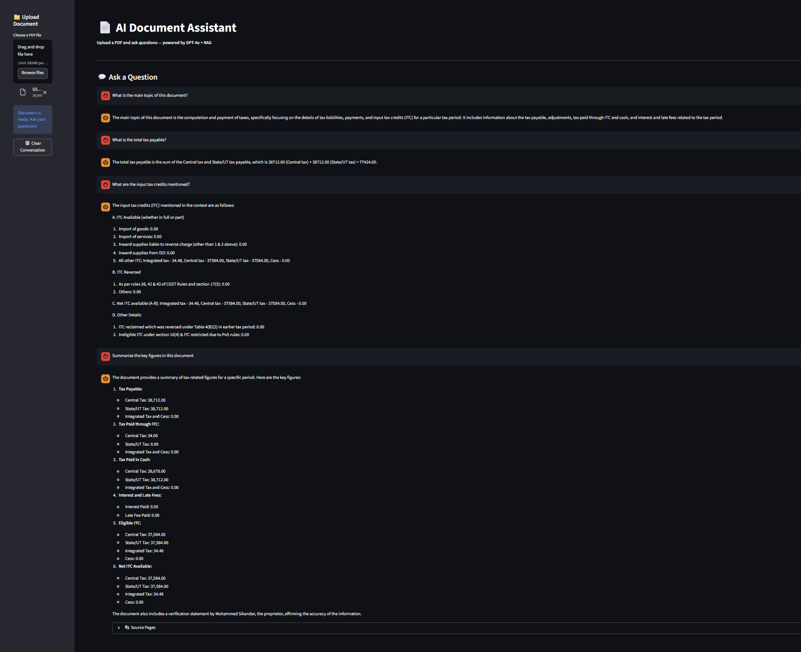
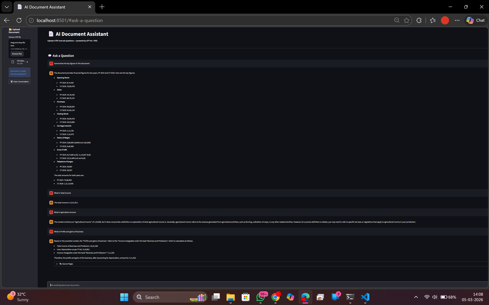
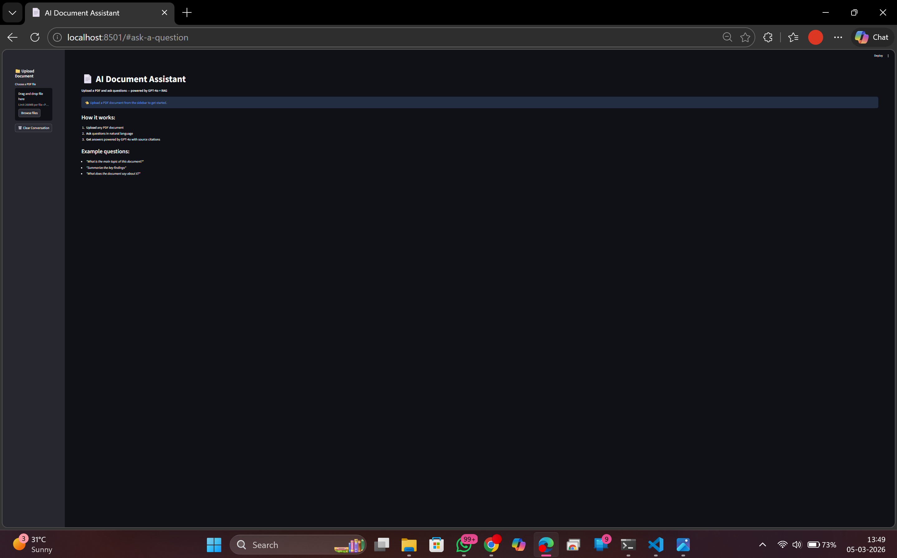

# 📄 AI Document Assistant

> RAG-powered document Q&A system — upload any PDF and ask questions using GPT-4o, LangChain, and ChromaDB.


---

## 🏢 Business Understanding

| | |
|---|---|
| **Business Problem** | Professionals in finance, legal, and consulting spend 30–40% of their time manually searching through large documents — tax filings, contracts, annual reports, research papers — to extract specific information. This is slow, error-prone, and non-scalable. |
| **Business Objective** | Build an AI-powered document assistant that allows users to upload any PDF and ask questions in natural language — instantly retrieving accurate, source-cited answers from the document without manual searching. |
| **Business Constraint** | Answers must be context-grounded (not hallucinated), source citations must be provided for every response, and the system must handle documents up to 200MB across diverse domains (finance, legal, medical, technical). |
| **Business Success Criteria** | Users can query any uploaded document in natural language and receive accurate, cited answers within 5 seconds — reducing document review time by 70–80% compared to manual search. |
| **ML Success Criteria** | RAG pipeline retrieves the correct document chunk in top-4 results for ≥ 90% of queries; GPT-4o generates factually grounded answers with source page citation on every response. |
| **Economic Success Criteria** | For a finance/legal professional spending 15 hours/week on document review at $50/hour, this tool saves ~10 hours/week = $26,000/year per user. Enterprise-scale deployment across 100 users = $2.6M annual productivity gain. |

## 🎯 What This Does

Upload any PDF document and ask questions in natural language. The system retrieves the most relevant sections from the document and uses GPT-4o to generate accurate, context-aware answers with source citations.

**Tested on real documents:**
- GST tax returns — extracted ITC details, tax payable breakdowns
- ITR 2024-2025 — extracted P&L figures, depreciation, total income

---

## 🖼️ Demo





---

## 1. How RAG Works
```
User uploads PDF
        ↓
Text extracted and split into chunks (1000 chars, 200 overlap)
        ↓
Each chunk converted to vector embedding (OpenAI)
        ↓
Embeddings stored in ChromaDB vector database
        ↓
User asks a question
        ↓
Top 4 most similar chunks retrieved from ChromaDB
        ↓
GPT-4o generates answer using retrieved context
        ↓
Answer + source page citations returned to user
```

---

## 2. Project Structure
```
ai-document-assistant/
│
├── app/
│   ├── document_processor.py  # PDF loading + text chunking
│   ├── embeddings.py          # ChromaDB vector store operations
│   ├── rag_chain.py           # LangChain RAG pipeline
│   ├── utils.py               # File handling + logging
│   └── __init__.py
│
├── docs/                      # Demo screenshots
├── main.py                    # Streamlit UI
├── requirements.txt
├── .gitignore                 # .env excluded
└── README.md
```

---

## 3. Key Features

- 📤 Upload any PDF document (up to 200MB)
- 💬 Natural language Q&A with full conversation history
- 🔍 Semantic search across document chunks (ChromaDB)
- 📚 Source page citations with every answer
- 🧠 GPT-4o for high-quality, context-aware responses
- 🗑️ Clear conversation and reload new document anytime

---

## 4. Tech Stack

| Component | Technology |
|---|---|
| LLM | GPT-4o (OpenAI) |
| Embeddings | text-embedding-3-small (OpenAI) |
| Vector Database | ChromaDB |
| RAG Framework | LangChain |
| PDF Processing | PyPDF |
| UI | Streamlit |
| Text Splitting | RecursiveCharacterTextSplitter |

---

## 5. RAG Pipeline Details

**Chunking Strategy:**
- Chunk size: 1,000 characters
- Overlap: 200 characters
- Splitter: RecursiveCharacterTextSplitter

**Retrieval:**
- Search type: Similarity search
- Top K chunks retrieved: 4
- Embedding model: text-embedding-3-small

**Generation:**
- Model: GPT-4o
- Temperature: 0.2 (factual, low creativity)
- Context: Retrieved chunks injected into system prompt

---

## 6. How to Run
```bash
# Clone repo
git clone https://github.com/ahamedkafeel22/ai-document-assistant.git
cd ai-document-assistant

# Install dependencies
pip install -r requirements.txt

# Create .env file
echo "OPENAI_API_KEY=your-key-here" > .env

# Run app
streamlit run main.py
```

---

## 7. Example Questions to Ask

| Document Type | Example Questions |
|---|---|
| Financial Report | "What is the total revenue?" |
| Tax Document | "What are the input tax credits?" |
| Legal Contract | "What are the termination clauses?" |
| Research Paper | "What is the main hypothesis?" |
| Annual Report | "Summarize the key risks mentioned" |

---

## 8. Limitations & Future Work

- No memory across sessions — conversation resets on page refresh
- Single PDF at a time — no multi-document querying
- API costs apply — each query uses OpenAI tokens
- Future: Add support for Word docs, CSVs, web URLs
- Future: Deploy to Streamlit Cloud for public access
- Future: Add conversation memory persistence

---

## 👤 Author

**Syed Kafeel Ahamed**

Finance professional with 6+ years of accounting experience transitioning into Data Science and AI.

🔗 [LinkedIn](https://www.linkedin.com/in/syed-kafeel-ahamed-ab465036b) | [GitHub](https://github.com/ahamedkafeel22)
